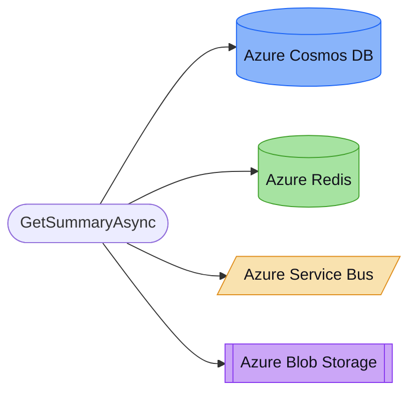

# Roadmap: Cloud Infrastructure Inventory (per service / repo)

> Give an engineering head a single, reliable answer to **"what cloud infrastructure does service X use?"** — databases, queues, caches, topics, streams, object storage, and secrets — fused from **two complementary sources** and attributed down to the calling function.

---

## Why

Today there is no way to ask "which cloud infra does this service depend on?":

- **Consumed side (application code)** — only outbound **HTTP calls** are detected (`HTTP_CALL` nodes, `_http_calls.py`, 6 languages). Database clients, message-queue producers/consumers, cache clients, and cloud-SDK usage (`CosmosClient`, `ServiceBusClient`, `BlobServiceClient`, `ConnectionMultiplexer`, `DbContext`, `boto3.client(...)`, …) are **not detected at all**.
- **Provisioned side (IaC)** — Terraform is parsed, but every cloud resource is stored as a generic `TF_RESOURCE` with the raw type in a property; there is **no categorization** into database/queue/cache/etc., and **no Bicep / ARM / CloudFormation / Pulumi** support. K8s, Helm, Docker, Ansible, and CI/CD are well-modeled but are orchestration primitives, not cloud services.

So the data is partially present but neither categorized nor fused, and the richest signal for a C#/Azure repo — the SDK clients in code — is missing entirely.

## Approach

A single **taxonomy table** maps both *code SDK-client patterns* and *IaC resource types* to a normalized `(provider, service, category)`. That one source of truth drives a new **code detector** (modeled on the proven `_http_calls.py` pattern) and **IaC classification**, both producing a unified **`CLOUD_RESOURCE`** node. Functions link to it via `USES_RESOURCE` (attribution); IaC links to it via `PROVISIONS`; a resolver fuses the two via `BACKED_BY`.

Mental model: extend the existing "code → HTTP_CALL → external" pattern to "code → CLOUD_RESOURCE ← IaC".

---

## Phase 1 — Graph model + taxonomy *(foundation; pure & testable)*

1. **Model** (`ast_intel/models/graph_model.py`): add one `NodeKind.CLOUD_RESOURCE` with structured properties `{provider, service, category, name, source: code|iac, client, caller, operation}`. Add `EdgeRelation.USES_RESOURCE` (function/method → resource) and `EdgeRelation.BACKED_BY` (code-usage ↔ IaC-provisioned). Reuse existing `PROVISIONS` (IaC → resource) and `BELONGS_TO` (resource → service).
2. **Taxonomy** (`ast_intel/extractors/_cloud_taxonomy.py`, new): two lookup tables — (a) IaC resource type → `(provider, service, category)` and (b) code client pattern → `(provider, service, category)` — plus the category enum: `database | cache | queue | topic | stream | storage | secret | other`.

### Deliverables
- `CLOUD_RESOURCE` in `NodeKind`; `USES_RESOURCE` + `BACKED_BY` in `EdgeRelation`.
- `_cloud_taxonomy.py` with exhaustive multi-cloud tables.
- `tests/test_cloud_taxonomy.py` — classification unit tests.

---

## Phase 2 — Code-side detection *(depends on P1)*

3. **Detector** (`ast_intel/extractors/_cloud_clients.py`, new): mirror `_http_calls.py` with per-language `detect_*` functions driven by a regex pattern table. Capture `provider, service, category, client, caller`, and a best-effort resource `name` (literal constructor arg, or the config-key string). Initial language coverage: **C#, Python, Java, TypeScript**.
4. **Emission** (`ast_intel/core/graph_builder.py`): add `_emit_cloud_resource_nodes()` beside `_emit_http_call_nodes()` (~L845). Emit `CONTAINS` (file → resource) and `USES_RESOURCE` (resolved caller function → resource) — the caller resolution **is** the attribution.

### SDK client patterns (initial)

| Provider | C# | Python | Java | TypeScript |
|---|---|---|---|---|
| **Azure** | `CosmosClient`, `BlobServiceClient`, `ServiceBusClient`, `QueueClient`, `ConnectionMultiplexer`, `SecretClient`, `TableServiceClient`, `EventGridPublisherClient`, `EventHubProducerClient` | `CosmosClient`, `BlobServiceClient`, `ServiceBusClient`, `QueueClient`, `SecretClient` | `CosmosClient`, `BlobServiceClient`, `ServiceBusClient` | `CosmosClient`, `BlobServiceClient`, `ServiceBusClient` |
| **AWS** | `AmazonS3Client`, `AmazonDynamoDBClient`, `AmazonSQSClient`, `AmazonSNSClient` | `boto3.client('s3'\|'dynamodb'\|'sqs'\|'sns'\|'kinesis'\|'secretsmanager')` | `S3Client`, `DynamoDbClient`, `SqsClient`, `SnsClient`, `KinesisClient` | `S3Client`, `DynamoDBClient`, `SQSClient` |
| **GCP** | — | `storage.Client`, `pubsub_v1.PublisherClient`, `spanner.Client`, `secretmanager.SecretManagerServiceClient` | `Storage`, `Publisher` | `Storage`, `PubSub` |
| **Generic** | `SqlConnection`, `DbContext`, `AddDbContext` | `psycopg2.connect`, `pymongo.MongoClient`, `redis.Redis` | `DriverManager.getConnection`, `JedisPool` | `createClient` (redis), `MongoClient`, `Sequelize` |

### Deliverables
- `_cloud_clients.py` with `detect_azure_clients()`, `detect_aws_clients()`, `detect_gcp_clients()`, `detect_generic_db_clients()` per language.
- `graph_builder._emit_cloud_resource_nodes()` + wiring in each language extractor.
- `tests/test_cloud_clients.py` — detector fixtures per language × provider.

---

## Phase 3 — IaC classification + Bicep/ARM *(parallel with P2)*

5. **Classify Terraform**: map each `TF_RESOURCE.resource_type` through the taxonomy into a `CLOUD_RESOURCE` (+ `PROVISIONS` edge).
6. **Bicep / ARM extractor** (`ast_intel/extractors/iac/bicep.py`, new; ARM JSON support): parse `resource x 'Microsoft.DocumentDB/databaseAccounts@…'` → database, `Microsoft.ServiceBus/…/queues` → queue, `Microsoft.Cache/redis` → cache, `Microsoft.Storage/storageAccounts` → storage, `Microsoft.KeyVault/vaults` → secret, `Microsoft.EventGrid/topics` → topic, `Microsoft.EventHub/…` → stream. Register in `cli._run_iac_pipeline` (~L162) following the `iac_base.py` extractor pattern.

### Terraform classification table (sample)

| `resource_type` | Provider | Service | Category |
|---|---|---|---|
| `aws_rds_instance`, `aws_rds_cluster` | aws | RDS | database |
| `aws_dynamodb_table` | aws | DynamoDB | database |
| `aws_sqs_queue` | aws | SQS | queue |
| `aws_sns_topic` | aws | SNS | topic |
| `aws_kinesis_stream` | aws | Kinesis | stream |
| `aws_s3_bucket` | aws | S3 | storage |
| `aws_secretsmanager_secret` | aws | Secrets Manager | secret |
| `aws_elasticache_cluster` | aws | ElastiCache | cache |
| `azurerm_cosmosdb_account` | azure | Cosmos DB | database |
| `azurerm_mssql_server` | azure | Azure SQL | database |
| `azurerm_servicebus_queue` | azure | Service Bus | queue |
| `azurerm_servicebus_topic` | azure | Service Bus | topic |
| `azurerm_eventhub` | azure | Event Hub | stream |
| `azurerm_eventgrid_topic` | azure | Event Grid | topic |
| `azurerm_redis_cache` | azure | Redis | cache |
| `azurerm_storage_account` | azure | Storage | storage |
| `azurerm_key_vault` | azure | Key Vault | secret |
| `google_sql_database_instance` | gcp | Cloud SQL | database |
| `google_spanner_instance` | gcp | Spanner | database |
| `google_pubsub_topic` | gcp | Pub/Sub | topic |
| `google_storage_bucket` | gcp | Cloud Storage | storage |
| `google_secret_manager_secret` | gcp | Secret Manager | secret |
| `google_redis_instance` | gcp | Memorystore | cache |

### Deliverables
- TF classify pass in `_iac_resolver.py` or `iac_graph_builder.py`.
- `extractors/iac/bicep.py` + ARM JSON variant.
- `tests/test_bicep_extractor.py`, `tests/test_tf_classify.py`.

---

## Phase 4 — Resolver: fuse + attribute *(depends on P2 + P3)*

7. **Cross-domain link** (`ast_intel/core/_iac_resolver.py`): new pass `_resolve_code_usage_to_iac` linking code-detected and IaC-provisioned resources that share `(provider, service, category)` + fuzzy name → `BACKED_BY`. Reuse the `_assign_belongs_to` mechanism to attribute every resource to its owning service.

### Deliverables
- `_resolve_code_usage_to_iac()` in `_iac_resolver.py`.
- `BACKED_BY` edges in graph linking code→iac.
- `tests/test_cloud_resolver.py`.

---

## Phase 5 — Surfaces: query the inventory *(depends on P2+)*

8. **CLI** (`ast_intel/cli.py`): new `ast-intel resources <repo>` command with `--service`, `--category`, `--provider`, `--json` filters (built on the existing query-engine pattern).
9. **MCP tool** (`ast_intel/mcp_server.py`, near `iac_overview` ~L963): `get_cloud_resources(service?, category?, provider?)` returning the per-service inventory + attribution so an agent can answer "what infra does X use?".
10. **JSON export**: a `resources.json` / structured payload for dashboards and audits.

### Example output (CLI)

```
$ ast-intel resources /path/to/mcfs --service REM.DataPlane.Api

REM.DataPlane.Api — Cloud Infrastructure
═══════════════════════════════════════════

 database (2)
   ├─ Azure Cosmos DB         via CosmosClient             caller: SovereignViewService.GetSummaryAsync
   └─ Azure Table Storage     via TableServiceClient       caller: SnapshotRepository.SaveAsync

 queue (1)
   └─ Azure Service Bus       via ServiceBusClient         caller: JobScheduler.EnqueueAsync

 cache (1)
   └─ Azure Redis             via ConnectionMultiplexer    caller: CacheProvider.GetOrSet

 storage (1)
   └─ Azure Blob Storage      via BlobServiceClient        caller: ReportExporter.UploadAsync

 secret (1)
   └─ Azure Key Vault         via SecretClient             caller: AuthService.GetCertificateAsync

 Total: 6 cloud resources (5 categories)
```

### Deliverables
- `ast-intel resources` command (typer subcommand).
- `get_cloud_resources` MCP tool.
- `resources.json` option.
- `tests/test_resources_cmd.py`, `tests/test_mcp_cloud_resources.py`.

---

## Phase 6 — Architecture viewer "Cloud Infra" tab *(depends on P2+)*

11. A new sixth view in `architecture.html`: per module, resources grouped by category with function → resource edges. Uses the existing `_arch_mermaid.py` builder + `_arch_html_template.py` tab pattern.

### Mermaid shape conventions



### Deliverables
- `cloud_infra_diagram(model, module)` in `_arch_mermaid.py`.
- New tab "☁ Cloud Infra" in `_arch_html_template.py`.
- Wire into `graph_arch_html_formatter.py` payload.

---

## Category taxonomy

| Category | Azure | AWS | GCP |
|---|---|---|---|
| `database` | Cosmos DB, Azure SQL, Table Storage | RDS, DynamoDB, Aurora | Cloud SQL, Spanner, Bigtable, Firestore |
| `cache` | Azure Cache for Redis | ElastiCache | Memorystore |
| `queue` | Service Bus queue, Storage queue | SQS | — |
| `topic` | Service Bus topic, Event Grid | SNS | Pub/Sub |
| `stream` | Event Hub | Kinesis | — |
| `storage` | Blob Storage | S3 | Cloud Storage |
| `secret` | Key Vault | Secrets Manager | Secret Manager |
| `other` | (AI, Search, Functions…) | … | … |

## The four surfaces

| Surface | Delivers |
|---|---|
| **CLI** `ast-intel resources <repo>` | Categorized inventory per service, filterable, `--json` |
| **MCP** `get_cloud_resources` | Agent-queryable inventory + attribution |
| **Viewer** "Cloud Infra" tab | Per-service resources grouped by category + fn→resource edges |
| **JSON export** | `resources.json` for dashboards / audits |

---

## Relevant files

| File | Change |
|---|---|
| `ast_intel/models/graph_model.py` | `CLOUD_RESOURCE` kind + `USES_RESOURCE` / `BACKED_BY` edges |
| `ast_intel/extractors/_cloud_taxonomy.py` *(new)* | Single source of truth for classification |
| `ast_intel/extractors/_cloud_clients.py` *(new)* | Code detectors mirroring `_http_calls.py` |
| `ast_intel/core/graph_builder.py` | `_emit_cloud_resource_nodes()` (cf. `_emit_http_call_nodes()` ~L845) |
| `ast_intel/extractors/iac/bicep.py` *(new)* | Bicep/ARM extractor |
| `ast_intel/core/_iac_resolver.py` | TF classify + `_resolve_code_usage_to_iac` + `BACKED_BY` |
| `ast_intel/cli.py` | `resources` command |
| `ast_intel/mcp_server.py` | `get_cloud_resources` tool (~L963 area) |
| `ast_intel/formatters/_arch_mermaid.py` | `cloud_infra_diagram()` builder |
| `ast_intel/formatters/_arch_html_template.py` | "Cloud Infra" tab |

---

## Verification

1. **Unit** — taxonomy classification (`aws_sqs_queue` → queue/aws, `Microsoft.Cache/redis` → cache/azure, `new CosmosClient` → database/azure); per-language detector fixtures; emission + resolver tests.
2. **Real** — scan **MCFS** (Azure/C#): expect Cosmos / Service Bus / Blob / Redis / Key Vault attributed per service with caller functions; a boto3 Python sample → DynamoDB / SQS / S3.
3. `make check` (lint + full suite).

---

## Decisions (locked)

| Decision | Choice | Rationale |
|---|---|---|
| Signal sources | Both code-usage + IaC-provisioned | Code tells what's consumed; IaC tells what's provisioned |
| Cloud scope | Multi-cloud: Azure + AWS + GCP | MCFS is Azure; extendable table-driven approach |
| Attribution depth | Full: caller function → resource | Engineering head needs "who uses what" |
| Node model | One `CLOUD_RESOURCE` + `category` property | Extensible, avoids enum explosion |
| Surfaces | All four (CLI + MCP + viewer + JSON) | Different consumers need different interfaces |
| Direction (read/write/pub/sub) | Deferred (v2) — emit `USES_RESOURCE` + best-effort `operation` | Hard to infer reliably from static analysis; start with presence |
| Resource name resolution | Best-effort: literal arg > config key > unnamed | Full config resolution (`appsettings.json`, env) deferred |

## Recommended v1 cut

**Ship**: P1 + P2 (C#/Python/Java/TS) + P3 (Terraform classify) + P5 (CLI/MCP/JSON).

**Immediate fast-follows**: Bicep/ARM (P3), viewer tab (P6), Go/Rust SDK detection.

---

## Deferred / out of scope (v2)

- Pulumi and CloudFormation IaC formats.
- Go and Rust SDK-client detection.
- Read/write/publish/consume **direction** inference.
- Resolving config-key resource names from `appsettings.json` / env binding.
- Connection-string parsing.
