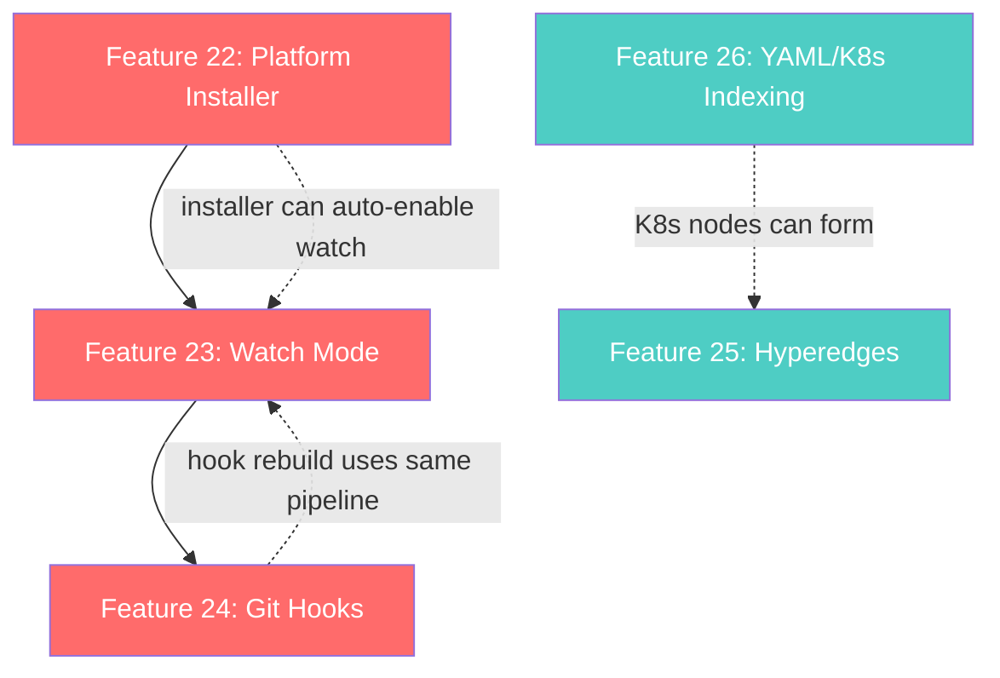

# AST_INTEL — Phase 4: Developer Experience & Graph Expressivity

> Generated 2026-05-07 · Architect Document  
> Prerequisite: Phases 1–3 complete (Spans, Call Graph, Confidence, Rationale, Graph Output, Analysis, Query CLI, MCP Server, Similarity, Microservice features).

---

## Table of Contents

1. [Feature 22 — AI Assistant Platform Installer](#feature-22--ai-assistant-platform-installer)
2. [Feature 23 — Watch Mode (Auto-Rebuild)](#feature-23--watch-mode-auto-rebuild)
3. [Feature 24 — Git Hooks (Post-Commit / Post-Checkout)](#feature-24--git-hooks-post-commit--post-checkout)
4. [Feature 25 — Hyperedges (Group Relationships)](#feature-25--hyperedges-group-relationships)
5. [Feature 26 — YAML / Kubernetes / Helm Indexing](#feature-26--yaml--kubernetes--helm-indexing)
6. [Dependency Graph Between Features](#dependency-graph-between-features)
7. [Suggested Implementation Order](#suggested-implementation-order)

---

## The Problem

AST_INTEL now has deep code analysis (8 languages, cross-service linking, 12 MCP tools, 14 CLI subcommands), but two categories of gaps remain visible when compared to mature alternatives:

1. **Adoption friction** — every teammate must manually edit `mcp.json` or configure their editor. There is no `ast-intel install --platform cursor` that wires everything in one command. The graph goes stale the moment a file is saved; there are no watch-mode or git hooks to keep it fresh.

2. **Graph expressivity** — the current model uses binary (pairwise) edges only. Patterns like "all 5 classes implementing the `Authenticator` protocol" or "the 3 functions forming the checkout flow" cannot be expressed as a single relationship. Additionally, infrastructure-as-code (Kubernetes manifests, Helm charts, Kustomize overlays) is invisible to the graph.

This phase addresses both categories with five targeted features.

---

## Feature 22 — AI Assistant Platform Installer

### What

A new `ast-intel install` CLI command that auto-configures the user's AI coding assistant to use AST_INTEL's MCP server and graph context. One command per platform — no manual JSON editing.

### Why

This is the **#1 adoption blocker**. Today, wiring AST_INTEL into an editor requires:

1. Knowing the absolute path to the `ast-intel` binary (conda, venv, pipx — all differ)
2. Manually creating/editing `.vscode/mcp.json`, `.cursor/mcp.json`, or `~/.config/claude/settings.json`
3. Getting the JSON syntax exactly right
4. Repeating for every teammate on every machine

Graphify solves this with `graphify install --platform <name>` for 15+ platforms. We need parity.

### Supported Platforms (Initial)

| Platform | Config File | Mechanism |
|---|---|---|
| VS Code Copilot Chat | `.vscode/mcp.json` | MCP server config |
| Cursor | `.cursor/mcp.json` | MCP server config |
| Windsurf | `.windsurf/mcp.json` | MCP server config |
| Claude Desktop | `~/.config/claude/claude_desktop_config.json` (Linux) / `~/Library/Application Support/Claude/claude_desktop_config.json` (macOS) | MCP server config |
| Claude Code | `CLAUDE.md` + `.claude/settings.json` | Instructions + MCP hook |
| Codex | `AGENTS.md` | Instructions file |

### How It Works

#### CLI Interface

```
ast-intel install                          # auto-detect platform from cwd
ast-intel install --platform vscode        # explicit platform
ast-intel install --platform cursor
ast-intel install --platform windsurf
ast-intel install --platform claude-desktop
ast-intel install --platform claude-code
ast-intel install --platform codex

ast-intel uninstall                         # remove config for auto-detected platform
ast-intel uninstall --platform cursor
```

#### Detection Logic

```python
def _detect_platform(cwd: Path) -> str:
    """Best-effort platform detection from workspace markers."""
    if (cwd / ".vscode").is_dir():
        return "vscode"
    if (cwd / ".cursor").is_dir():
        return "cursor"
    if (cwd / ".windsurf").is_dir():
        return "windsurf"
    # Fall back to checking running processes or ask user
    raise typer.BadParameter("Cannot auto-detect platform. Use --platform.")
```

#### Config Generation

Each platform installer:

1. **Locates the `ast-intel` binary** — `shutil.which("ast-intel")` → absolute path
2. **Resolves the graph path** — looks for `ast_output/graph.json` in cwd
3. **Writes the platform-specific config** — merges into existing JSON if present (never overwrites unrelated keys)
4. **Optionally writes an instructions file** — `copilot-instructions.md`, `CLAUDE.md`, or `AGENTS.md` telling the assistant to use the graph

Example generated `.vscode/mcp.json`:

```json
{
  "servers": {
    "ast-intel": {
      "type": "stdio",
      "command": "/home/user/anaconda3/bin/ast-intel",
      "args": ["serve", "--analyze", "--similarity"]
    }
  }
}
```

Example generated `.github/copilot-instructions.md` snippet:

```markdown
## AST_INTEL Graph Context

This project has a code knowledge graph at `ast_output/`.
Before answering architecture questions, read `ast_output/summary.md`
for god nodes, community structure, and surprising connections.
Use the ast-intel MCP tools (search_symbols, find_path, explain_symbol,
get_impact, get_dependencies, get_context, find_usages) for precise queries.
```

### Design Decisions

| Decision | Options | Choice | Rationale |
|---|---|---|---|
| Config write strategy | A) Overwrite entire file, B) JSON-merge existing | **B) Merge** | Never destroy user's other MCP servers or settings |
| Binary detection | A) Hardcode path, B) `shutil.which`, C) `sys.executable -m ast_intel` | **B + C fallback** | `which` covers pip/pipx/uv; `sys.executable` covers conda/venv |
| Instructions file | A) Always write, B) Opt-in `--with-instructions` | **A) Always** | The instructions are non-destructive and append-only |
| Uninstall | A) Delete entire config, B) Remove only ast-intel key | **B) Surgical** | Never break other tools |

### Phased Implementation

#### Phase 22A — Core Installer Framework

**Files**: new `ast_intel/core/_installer.py`

```python
@dataclass
class PlatformConfig:
    """Definition of how to install for a specific platform."""
    name: str
    config_path: Callable[[Path], Path]    # workspace → config file path
    config_format: Literal["json", "markdown"]
    merge_strategy: Callable[[dict, dict], dict]

def install(platform: str, workspace: Path) -> None:
    """Install AST_INTEL config for the given platform."""

def uninstall(platform: str, workspace: Path) -> None:
    """Remove AST_INTEL config for the given platform."""

def detect_binary() -> str:
    """Find the absolute path to the ast-intel CLI."""
```

#### Phase 22B — CLI Commands

**Files**: `ast_intel/cli.py`

Add two new subcommands:

```python
@app.command("install")
def install_cmd(
    platform: Annotated[str | None, typer.Option("--platform", "-p")] = None,
    with_instructions: Annotated[bool, typer.Option("--with-instructions")] = True,
    repo: Annotated[Path, typer.Argument()] = Path("."),
) -> None: ...

@app.command("uninstall")
def uninstall_cmd(
    platform: Annotated[str | None, typer.Option("--platform", "-p")] = None,
    repo: Annotated[Path, typer.Argument()] = Path("."),
) -> None: ...
```

#### Phase 22C — Per-Platform Configs

One function per platform. Initial batch: vscode, cursor, windsurf, claude-desktop, claude-code, codex.

### Test Plan

| Test | Validates |
|---|---|
| `test_install_vscode_creates_mcp_json` | Creates `.vscode/mcp.json` with correct structure |
| `test_install_merges_existing_config` | Existing MCP servers preserved, ast-intel key added |
| `test_uninstall_removes_only_ast_intel` | Other keys untouched after uninstall |
| `test_detect_binary_which` | Finds binary via `shutil.which` |
| `test_detect_binary_sys_executable` | Fallback to `sys.executable -m ast_intel.cli` |
| `test_detect_platform_vscode` | Detects `.vscode/` directory |
| `test_install_claude_desktop_linux` | Writes to `~/.config/claude/` on Linux |
| `test_instructions_file_appends` | Does not overwrite existing instructions content |

### Safeguards

- **Never overwrite** — always JSON-merge or append
- **Validate JSON** before writing (don't corrupt user's config)
- **Atomic write** — write to temp file, then `os.replace()`
- **Backup** — copy existing config to `.bak` before modifying

---

## Feature 23 — Watch Mode (Auto-Rebuild)

### What

A new `ast-intel watch` command that monitors the workspace for file changes and incrementally rebuilds the graph. Code changes trigger instant AST re-extraction (no LLM, deterministic). The graph stays fresh without manual re-runs.

### Why

Today, the graph becomes stale the moment someone saves a file. Users must re-run `ast-intel scan` manually. In a team workflow, this means the MCP server and query tools return outdated results.

Watch mode is table-stakes DX for any tool that produces derived artifacts (TypeScript compiler, Vite, Tailwind, ESLint — they all have `--watch`).

### How It Works

#### Architecture

```
┌────────────┐     file event      ┌──────────────┐     changed files     ┌─────────────────┐
│  watchdog   │ ──────────────────→ │  debouncer    │ ──────────────────→ │  incremental      │
│  observer   │                    │  (0.5s batch) │                      │  rebuild pipeline │
│             │                    │               │                      │                   │
│  inotify /  │                    │  dedup &      │                      │  extract changed  │
│  kqueue /   │                    │  filter       │                      │  files only →     │
│  polling    │                    │               │                      │  rebuild graph →  │
└────────────┘                    └──────────────┘                      │  emit output      │
                                                                        └─────────────────┘
```

#### CLI Interface

```
ast-intel watch /path/to/repo                  # watch with defaults
ast-intel watch /path/to/repo --debounce 1.0   # batch changes for 1s
ast-intel watch /path/to/repo --format html    # rebuild HTML on every change
ast-intel watch /path/to/repo --no-emit        # rebuild graph.json only, skip md/html
```

#### Debouncing

File saves often trigger multiple events (write + rename on some editors). The watcher batches events with a configurable debounce window (default: 500ms). After the window closes, only genuinely changed files are re-processed.

```python
class DebouncedHandler(FileSystemEventHandler):
    """Collects file events and triggers rebuild after debounce period."""

    def __init__(self, callback: Callable[[set[Path]], None], debounce: float = 0.5):
        self._pending: set[Path] = set()
        self._timer: threading.Timer | None = None
        self._debounce = debounce
        self._callback = callback
        self._lock = threading.Lock()

    def on_modified(self, event: FileSystemEvent) -> None:
        if event.is_directory:
            return
        path = Path(event.src_path)
        if not self._should_watch(path):
            return
        with self._lock:
            self._pending.add(path)
            if self._timer:
                self._timer.cancel()
            self._timer = threading.Timer(self._debounce, self._flush)
            self._timer.start()
```

#### File Filtering

Reuses existing `WorkspaceDiscovery` logic:
- Respects `.ast-intel-ignore` and `.gitignore`
- Only watches file extensions the `Dispatcher` can handle
- Skips `ast_output/` (our own output directory) to avoid feedback loops

#### Incremental Rebuild Pipeline

```python
def _rebuild(changed_files: set[Path], workspace_root: Path) -> None:
    """Re-extract only changed files and rebuild the graph."""
    # 1. Load existing cache
    cache = IncrementalCache(output_dir)
    
    # 2. Check which files actually changed (SHA-256)
    truly_changed = {f for f in changed_files if cache.is_stale(f)}
    if not truly_changed:
        return  # false alarm (editor temp write)
    
    # 3. Re-extract only changed files via Dispatcher
    for f in truly_changed:
        dispatcher.extract_file(f)
    
    # 4. Rebuild full graph (re-index + re-emit)
    # Uses cached results for unchanged files + fresh results for changed
    
    # 5. Update cache
    cache.update(truly_changed)
    
    # 6. Log what changed
    console.print(f"[green]✓[/] Rebuilt graph — {len(truly_changed)} file(s) changed")
```

### Design Decisions

| Decision | Options | Choice | Rationale |
|---|---|---|---|
| File watcher library | A) `watchdog`, B) `inotify` direct, C) polling | **A) watchdog** | Cross-platform (Linux inotify, macOS FSEvents, Windows ReadDirectoryChanges), mature, pip-installable |
| Dependency scope | A) Core dependency, B) Optional extra | **B) Optional** `[watch]` | Don't bloat the base install for users who never use watch |
| Rebuild scope | A) Full re-scan, B) Incremental (changed files only) | **B) Incremental** | Leverage existing `IncrementalCache` — re-scanning everything defeats the purpose |
| Graph output | A) Always full pipeline, B) `--no-emit` for graph.json only | **B) Configurable** | Some users want just the JSON; HTML/DOT rebuilds are expensive |

### Phased Implementation

#### Phase 23A — Dependency & Watcher Core

**Files**: new `ast_intel/core/_watcher.py`

```python
class FileWatcher:
    """Watches a workspace directory for file changes."""

    def __init__(
        self,
        workspace_root: Path,
        callback: Callable[[set[Path]], None],
        debounce: float = 0.5,
        ignore_spec: pathspec.PathSpec | None = None,
    ): ...

    def start(self) -> None: ...
    def stop(self) -> None: ...
```

**Dependency**: Add `watchdog` to `pyproject.toml` under `[watch]` extra:

```toml
[project.optional-dependencies]
watch = ["watchdog>=4.0"]
```

#### Phase 23B — Incremental Rebuild

**Files**: `ast_intel/core/_watcher.py` (extend)

Wire the watcher callback into the existing scan pipeline:
1. Load existing `WorkspaceAST` from cache
2. Re-extract changed files
3. Merge new extractions into existing `WorkspaceAST`
4. Rebuild `CodeGraph` from the updated `WorkspaceAST`
5. Emit outputs

#### Phase 23C — CLI Command

**Files**: `ast_intel/cli.py`

```python
@app.command("watch")
def watch_cmd(
    repo: Annotated[Path, typer.Argument()] = Path("."),
    debounce: Annotated[float, typer.Option("--debounce")] = 0.5,
    format: Annotated[OutputFormat, typer.Option("--format", "-f")] = OutputFormat.GRAPH_JSON,
    output: Annotated[Path | None, typer.Option("--output", "-o")] = None,
    no_emit: Annotated[bool, typer.Option("--no-emit")] = False,
) -> None:
    """Watch workspace for changes and auto-rebuild the graph."""
```

### Test Plan

| Test | Validates |
|---|---|
| `test_debounce_batches_events` | Multiple rapid events → single callback |
| `test_ignores_output_directory` | Changes in `ast_output/` don't trigger rebuild |
| `test_respects_ignore_patterns` | `.ast-intel-ignore` patterns are filtered |
| `test_incremental_rebuild_only_changed` | Unchanged files use cache, only changed re-extracted |
| `test_sha_check_filters_false_positives` | Editor temp writes with same content are skipped |
| `test_watch_stop_cleanup` | Observer thread shuts down cleanly on Ctrl+C |

---

## Feature 24 — Git Hooks (Post-Commit / Post-Checkout)

### What

A new `ast-intel hook install` command that installs git hooks to auto-rebuild the graph after every commit and branch switch. Also provides a git merge driver so `graph.json` never has conflict markers.

### Why

Watch mode keeps the graph fresh during active development. Git hooks keep it fresh across commits and branch switches — the two moments where the working tree changes en masse but no file-save event fires.

Together, watch mode + git hooks guarantee the graph is **always current**. No team member ever sees stale results.

### How It Works

#### CLI Interface

```
ast-intel hook install              # install post-commit + post-checkout hooks
ast-intel hook uninstall            # remove hooks
ast-intel hook status               # show which hooks are installed
```

#### Post-Commit Hook

```bash
#!/bin/sh
# .git/hooks/post-commit — installed by ast-intel hook install
# Rebuilds the AST_INTEL graph after every commit (AST only, no LLM, fast).

AST_INTEL_BIN="__AST_INTEL_PATH__"
if [ -x "$AST_INTEL_BIN" ]; then
    "$AST_INTEL_BIN" scan . --format graph-json --output ast_output --quiet 2>/dev/null || true
fi
```

#### Post-Checkout Hook

```bash
#!/bin/sh
# .git/hooks/post-checkout — installed by ast-intel hook install
# Rebuilds graph when switching branches.

# Only run on branch switch (flag=1), not file checkout (flag=0)
if [ "$3" = "1" ]; then
    AST_INTEL_BIN="__AST_INTEL_PATH__"
    if [ -x "$AST_INTEL_BIN" ]; then
        "$AST_INTEL_BIN" scan . --format graph-json --output ast_output --quiet 2>/dev/null || true
    fi
fi
```

#### Git Merge Driver for `graph.json`

When two developers commit different graph changes on different branches, `git merge` would leave conflict markers in `graph.json` (binary-ish JSON). The merge driver avoids this by re-running the scan:

**.gitattributes** (written by `ast-intel hook install`):

```
ast_output/graph.json merge=ast-intel-graph
```

**.git/config** addition:

```ini
[merge "ast-intel-graph"]
    name = AST_INTEL graph merge driver
    driver = __AST_INTEL_PATH__ scan . --format graph-json --output ast_output --quiet
```

This means on conflict, git runs a fresh scan instead of trying to merge JSON.

### Design Decisions

| Decision | Options | Choice | Rationale |
|---|---|---|---|
| Hook installation | A) Symlinks, B) Shell scripts in `.git/hooks/`, C) core.hooksPath | **B) Direct scripts** | Most compatible; doesn't conflict with husky or other hook managers |
| Existing hooks | A) Overwrite, B) Append, C) Fail if exists | **B) Append** | Prepend a guard (`# ast-intel-hook-start` / `# ast-intel-hook-end`) so we can surgically remove later |
| Merge driver | A) Skip, B) Union-merge JSON, C) Re-scan | **C) Re-scan** | Guaranteed correct; JSON union-merge is fragile |
| `--quiet` flag | A) Existing, B) Add new | **B) Add `--quiet`** | Hooks should not spam the terminal during `git commit` |

### Phased Implementation

#### Phase 24A — Hook Manager

**Files**: new `ast_intel/core/_hooks.py`

```python
HOOK_START_MARKER = "# >>> ast-intel-hook-start"
HOOK_END_MARKER   = "# <<< ast-intel-hook-end"

def install_hooks(repo: Path) -> list[str]:
    """Install post-commit and post-checkout hooks. Returns list of installed hook names."""

def uninstall_hooks(repo: Path) -> list[str]:
    """Remove ast-intel sections from hooks. Returns list of cleaned hook names."""

def hook_status(repo: Path) -> dict[str, bool]:
    """Return {hook_name: is_installed} for each managed hook."""
```

#### Phase 24B — Merge Driver

**Files**: `ast_intel/core/_hooks.py` (extend)

```python
def install_merge_driver(repo: Path) -> None:
    """Configure .gitattributes and .git/config for graph.json merge driver."""

def uninstall_merge_driver(repo: Path) -> None:
    """Remove merge driver config."""
```

#### Phase 24C — CLI Commands

**Files**: `ast_intel/cli.py`

```python
@app.command("hook")
def hook_cmd(
    action: Annotated[str, typer.Argument(help="install | uninstall | status")],
    repo: Annotated[Path, typer.Argument()] = Path("."),
) -> None:
    """Manage git hooks for automatic graph rebuild."""
```

Also add `--quiet` flag to `scan` command to suppress rich console output.

### Test Plan

| Test | Validates |
|---|---|
| `test_install_creates_post_commit_hook` | Hook file exists with correct content |
| `test_install_appends_to_existing_hook` | Existing hook content preserved |
| `test_uninstall_removes_only_markers` | Content outside markers untouched |
| `test_hook_status_reports_correctly` | Status dict reflects actual hook state |
| `test_merge_driver_gitattributes` | `.gitattributes` has the merge driver line |
| `test_hook_executable_permissions` | Hook files have `chmod +x` |
| `test_idempotent_install` | Running install twice doesn't duplicate the hook block |

### Safeguards

- Hook block is clearly delimited with start/end markers
- Never overwrites existing non-ast-intel hook content
- Hook scripts use `|| true` to never block `git commit` on failure
- `uninstall` is fully reversible — restores original hook content

---

## Feature 25 — Hyperedges (Group Relationships)

### What

Extend the graph model with **hyperedges** — edges that connect 3 or more nodes as a single relationship. Examples:

- All 5 classes implementing the `Authenticator` protocol → one `IMPLEMENTS_GROUP` hyperedge
- The 3 functions forming the checkout flow → one `FLOW` hyperedge  
- All routes belonging to the `/api/v2/` prefix → one `ROUTE_GROUP` hyperedge

### Why

Current binary edges can only express `A → B`. When a pattern involves N nodes, we store $\binom{N}{2}$ pairwise edges, losing the information that they form a **group**. Hyperedges make group patterns queryable as a single entity.

Use cases:
- "Show me all classes implementing `Repository`" → one hyperedge instead of scanning all `IMPLEMENTS` edges
- "What's the auth flow?" → one `FLOW` hyperedge with ordered members
- Community detection already finds groups; hyperedges let us **persist** notable groups in the graph itself

### How It Works

#### Model Extension

```python
# ast_intel/models/graph_model.py

@dataclass
class HyperEdge:
    """A relationship connecting 3+ nodes as a single group.

    Unlike binary ``GraphEdge``s, a hyperedge has an ordered list of
    member node IDs and a group-level relation type.
    """

    id: str                          # unique hyperedge ID
    relation: HyperRelation          # type of group relationship
    members: list[str]               # ordered list of node IDs
    label: str = ""                  # human-readable description
    metadata: dict[str, str] = field(default_factory=dict)

class HyperRelation(StrEnum):
    """Types of hyperedge group relationships."""
    IMPLEMENTS_GROUP = "implements_group"   # all types implementing a trait/interface
    FLOW = "flow"                          # ordered sequence of functions in a workflow
    ROUTE_GROUP = "route_group"            # routes sharing a prefix
    FIELD_GROUP = "field_group"            # structs sharing field types
    COMMUNITY = "community"               # Leiden community persisted as hyperedge
```

#### CodeGraph Extension

```python
@dataclass
class CodeGraph:
    meta: WorkspaceMeta
    nodes: list[GraphNode]
    edges: list[GraphEdge]
    hyperedges: list[HyperEdge] = field(default_factory=list)  # NEW
```

#### Automatic Hyperedge Detection

After the graph is built, a post-processing pass detects group patterns:

```python
def detect_hyperedges(graph: CodeGraph) -> list[HyperEdge]:
    """Scan binary edges for group patterns and emit hyperedges."""
    hyperedges = []

    # 1. IMPLEMENTS_GROUP: group all types implementing the same trait
    impl_groups = defaultdict(list)
    for edge in graph.edges:
        if edge.relation == EdgeRelation.IMPLEMENTS:
            impl_groups[edge.target].append(edge.source)
    for trait_id, implementors in impl_groups.items():
        if len(implementors) >= 3:
            hyperedges.append(HyperEdge(
                id=f"hg::impl::{trait_id}",
                relation=HyperRelation.IMPLEMENTS_GROUP,
                members=[trait_id] + implementors,
                label=f"All implementors of {trait_id}",
            ))

    # 2. ROUTE_GROUP: group routes by path prefix
    # 3. COMMUNITY: persist Leiden communities as hyperedges
    # 4. FLOW: detect linear call chains (A→B→C→D with no branching)

    return hyperedges
```

#### Serialization (graph.json)

```json
{
  "meta": { ... },
  "nodes": [ ... ],
  "edges": [ ... ],
  "hyperedges": [
    {
      "id": "hg::impl::Authenticator",
      "relation": "implements_group",
      "members": ["Authenticator", "JWTAuth", "OAuth2Auth", "APIKeyAuth", "SessionAuth"],
      "label": "All implementors of Authenticator",
      "metadata": {}
    }
  ]
}
```

### Design Decisions

| Decision | Options | Choice | Rationale |
|---|---|---|---|
| Storage | A) Separate `hyperedges` list, B) Special edge type with multi-target, C) Virtual nodes | **A) Separate list** | Cleanest model; no confusion with binary edges; easy to serialize |
| Detection | A) Manual annotation only, B) Automatic from binary edges, C) Both | **C) Both** | Automatic catches common patterns; manual allows user curation |
| Minimum group size | A) 2+, B) 3+ | **B) 3+** | Two nodes = regular edge; hyperedges add value at 3+ |
| Backward compat | `hyperedges` key absent in old graphs = empty list | Graceful | Old tools ignore it; new tools get an empty list |

### Phased Implementation

#### Phase 25A — Model Extension

**Files**: `ast_intel/models/graph_model.py`

1. Add `HyperRelation` enum
2. Add `HyperEdge` dataclass
3. Add `hyperedges: list[HyperEdge]` to `CodeGraph`

#### Phase 25B — Detection Engine

**Files**: new `ast_intel/core/_hyperedge.py`

```python
def detect_hyperedges(graph: CodeGraph) -> list[HyperEdge]:
    """Post-process binary edges to find group patterns."""
```

#### Phase 25C — Serialization & Query

**Files**: `ast_intel/core/emitter.py`, `ast_intel/formatters/json_formatter.py`

1. Emit `hyperedges` in `graph.json`
2. Add `--hyperedges` flag to `query` command to include hyperedge results
3. Add `get_hyperedges` MCP tool

#### Phase 25D — Integration with Analyzer

**Files**: `ast_intel/core/analyzer.py`

Persist Leiden communities as `COMMUNITY` hyperedges in the graph.

### Test Plan

| Test | Validates |
|---|---|
| `test_implements_group_detected` | 3+ implementors → one hyperedge |
| `test_two_implementors_no_hyperedge` | 2 implementors → no hyperedge (minimum 3) |
| `test_route_group_by_prefix` | Routes with shared `/api/v2/` prefix grouped |
| `test_hyperedge_serialization_roundtrip` | JSON write → read preserves all fields |
| `test_backward_compat_no_hyperedges_key` | Old graph.json without `hyperedges` loads as empty list |
| `test_community_hyperedges` | Leiden communities persisted as hyperedges |

---

## Feature 26 — YAML / Kubernetes / Helm Indexing

### What

A new `YamlExtractor` that parses YAML files for infrastructure-as-code patterns (Kubernetes manifests, Helm charts, Kustomize overlays, Docker Compose, GitHub Actions) and represents them as first-class graph nodes.

### Why

In microservice architectures, the infrastructure layer is as important as the application code:

- **Kubernetes Deployments** reference Docker images that map to services → `DEPLOYS` edge
- **Helm values** configure application behavior → `CONFIGURES` edge  
- **Kustomize overlays** patch base manifests → `PATCHES` edge
- **GitHub Actions** build and deploy services → `BUILDS` edge
- **Docker Compose** links services together → `LINKS_TO` edge

Today, all of these are invisible to the graph. A `deployment.yaml` that deploys `user-service:v2.1` has no connection to the `user-service` `SERVICE` node in the merged graph.

### How It Works

#### New Node Kinds

```python
class NodeKind(StrEnum):
    # ... existing ...
    K8S_RESOURCE = "k8s_resource"     # Deployment, Service, ConfigMap, etc.
    HELM_CHART = "helm_chart"         # Helm Chart.yaml
    DOCKER_IMAGE = "docker_image"     # container image reference
    CI_WORKFLOW = "ci_workflow"       # GitHub Actions / GitLab CI workflow
```

#### New Edge Relations

```python
class EdgeRelation(StrEnum):
    # ... existing ...
    DEPLOYS = "deploys"           # K8S_RESOURCE → SERVICE (Deployment deploys a service)
    CONFIGURES = "configures"     # K8S_RESOURCE → K8S_RESOURCE (ConfigMap configures Deployment)
    REFERENCES_IMAGE = "references_image"  # K8S_RESOURCE → DOCKER_IMAGE
```

#### Extraction Strategy

YAML files are parsed with `PyYAML` (already available via `[contracts]` extra). The extractor identifies patterns by `apiVersion` + `kind` fields:

```python
class YamlExtractor(ExtractorBase):
    """Extract infrastructure nodes from YAML/YML files."""

    SUPPORTED_EXTENSIONS = {".yaml", ".yml"}

    def extract(self, path: Path, content: str) -> list[ASTNode]:
        docs = yaml.safe_load_all(content)
        nodes = []
        for doc in docs:
            if not isinstance(doc, dict):
                continue
            kind = doc.get("kind", "")
            api_version = doc.get("apiVersion", "")
            
            if kind in ("Deployment", "StatefulSet", "DaemonSet", "Job", "CronJob"):
                nodes.extend(self._extract_workload(doc, path))
            elif kind in ("Service", "Ingress", "Gateway"):
                nodes.extend(self._extract_network(doc, path))
            elif kind in ("ConfigMap", "Secret"):
                nodes.extend(self._extract_config(doc, path))
            elif self._is_docker_compose(doc):
                nodes.extend(self._extract_compose(doc, path))
            elif self._is_github_actions(doc):
                nodes.extend(self._extract_actions(doc, path))
        return nodes
```

#### Cross-Linking to Application Code

After extraction, the graph builder creates edges between infra nodes and application nodes:

```
Deployment("user-service") --[DEPLOYS]--> SERVICE("user-service")
Deployment("user-service") --[REFERENCES_IMAGE]--> DOCKER_IMAGE("ghcr.io/org/user-service:v2")
ConfigMap("user-config")   --[CONFIGURES]--> Deployment("user-service")
```

The link is made by matching the Deployment's `metadata.name` or container image name against known `SERVICE` node labels from the merged graph.

### Supported Formats (Initial)

| Format | Detection | Extracted |
|---|---|---|
| Kubernetes manifests | `apiVersion` + `kind` fields | Deployments, Services, ConfigMaps, Secrets, Ingress, Jobs |
| Helm `Chart.yaml` | `apiVersion: v2` + `type: application` | Chart name, version, dependencies |
| Helm `values.yaml` | Sibling to `Chart.yaml` | Configuration keys → `CONFIGURES` edges |
| Docker Compose | `services:` top-level key | Service definitions, port mappings, depends_on → edges |
| GitHub Actions | `.github/workflows/*.yml` | Workflow name, jobs, steps with `uses:` actions |
| Kustomize | `resources:` + `patches:` | Base/overlay relationships |

### Design Decisions

| Decision | Options | Choice | Rationale |
|---|---|---|---|
| Parser | A) PyYAML, B) ruamel.yaml, C) tree-sitter-yaml | **A) PyYAML** | Already a dependency via `[contracts]`; YAML AST isn't needed — we need semantic values |
| Dependency scope | A) Core, B) Optional extra | **B)** `[infra]` extra | PyYAML is lightweight but YAML indexing is opt-in |
| Node granularity | A) One node per file, B) One per K8s resource, C) One per container | **B) Per resource** | A Deployment with 3 containers = 1 K8S_RESOURCE + 3 DOCKER_IMAGE nodes |
| Security | A) `yaml.safe_load`, B) `yaml.load` | **A) safe_load only** | Never execute arbitrary Python from YAML (CWE-502) |

### Phased Implementation

#### Phase 26A — Model Extension

**Files**: `ast_intel/models/graph_model.py`, `ast_intel/models/ast_node.py`

1. Add `K8S_RESOURCE`, `HELM_CHART`, `DOCKER_IMAGE`, `CI_WORKFLOW` to `NodeKind`
2. Add `DEPLOYS`, `CONFIGURES`, `REFERENCES_IMAGE` to `EdgeRelation`
3. Add `K8sResourceNode` dataclass with `api_version`, `kind`, `name`, `namespace`, `labels`

#### Phase 26B — YAML Extractor

**Files**: new `ast_intel/extractors/yaml.py`

Core extraction logic for K8s, Compose, Helm, GitHub Actions.

#### Phase 26C — Dispatcher Integration

**Files**: `ast_intel/core/dispatcher.py`

Register `.yaml` / `.yml` extensions with the `YamlExtractor`. Filter out non-infra YAML (e.g., plain config files with no `apiVersion`/`kind`).

#### Phase 26D — Cross-Linking

**Files**: `ast_intel/core/graph_builder.py`

After all extraction, link K8S_RESOURCE nodes to SERVICE nodes by name matching.

### Test Plan

| Test | Validates |
|---|---|
| `test_deployment_extraction` | K8S_RESOURCE node with correct metadata |
| `test_deployment_deploys_service` | `DEPLOYS` edge to matching SERVICE node |
| `test_configmap_configures_deployment` | `CONFIGURES` edge with envFrom/volume mount |
| `test_docker_compose_services` | Each Compose service → node + `LINKS_TO` edges |
| `test_github_actions_workflow` | CI_WORKFLOW node with job/step info |
| `test_helm_chart_dependencies` | Helm chart → DEPENDS_ON edges for subchart deps |
| `test_safe_load_only` | Malicious YAML with `!!python/exec` is safely ignored |
| `test_multi_document_yaml` | Files with `---` separators produce multiple nodes |
| `test_non_k8s_yaml_skipped` | Plain config YAML (no apiVersion/kind) produces no infra nodes |

### Fixtures Needed

```
tests/fixtures/yaml/
├── deployment.yaml           # standard K8s Deployment
├── service.yaml              # K8s Service + Ingress
├── configmap.yaml            # ConfigMap with data
├── docker-compose.yml        # multi-service Compose file
├── github-actions.yml        # CI workflow
├── helm-chart/
│   ├── Chart.yaml
│   └── values.yaml
└── plain-config.yaml         # non-infra YAML (should be skipped)
```

---

## Dependency Graph Between Features



**Hard dependencies:**
- Feature 24 (Git Hooks) requires Feature 23 (Watch Mode) — the rebuild pipeline is shared
- Feature 22 (Installer) is independent but benefits from 23/24 being done (installer can configure watch)

**Soft dependencies:**
- Feature 26 (YAML) feeds into Feature 25 (Hyperedges) — K8s resources form natural groups

**Fully independent:**
- Feature 25 (Hyperedges) can be built at any time
- Feature 26 (YAML) can be built at any time

---

## Suggested Implementation Order

```
Week 1:  Feature 22 (Platform Installer)     — P0, highest adoption impact
         Feature 23A (Watcher core)           — start in parallel

Week 2:  Feature 23B-C (Watch rebuild + CLI)  — P0, completes watch mode
         Feature 24 (Git Hooks)               — P0, 1-2 days, pairs with watch

Week 3:  Feature 26 (YAML/K8s Indexing)       — P2, independent track
         Feature 25A-B (Hyperedge model + detection) — P2, start in parallel

Week 4:  Feature 25C-D (Serialization + analyzer integration)
         Integration testing across all features
         Update docs/SETUP_INSTRUCTIONS_README.md with install command
```

### New Dependencies Summary

| Feature | New pip dependency | Extra name | Why |
|---|---|---|---|
| 23 (Watch) | `watchdog>=4.0` | `[watch]` | Cross-platform filesystem events |
| 26 (YAML) | `pyyaml>=6.0` | `[infra]` | Already available via `[contracts]`; can share |

### New Files Summary

| Feature | New Files |
|---|---|
| 22 | `ast_intel/core/_installer.py` |
| 23 | `ast_intel/core/_watcher.py` |
| 24 | `ast_intel/core/_hooks.py` |
| 25 | `ast_intel/core/_hyperedge.py` |
| 26 | `ast_intel/extractors/yaml.py`, `tests/fixtures/yaml/` (7 fixture files) |

### New CLI Commands Summary

| Command | Feature |
|---|---|
| `ast-intel install [--platform NAME]` | 22 |
| `ast-intel uninstall [--platform NAME]` | 22 |
| `ast-intel watch [REPO]` | 23 |
| `ast-intel hook install\|uninstall\|status` | 24 |

### Graph Model Additions

| Addition | Feature |
|---|---|
| `HyperEdge` dataclass | 25 |
| `HyperRelation` enum (5 values) | 25 |
| `CodeGraph.hyperedges` field | 25 |
| `K8S_RESOURCE`, `HELM_CHART`, `DOCKER_IMAGE`, `CI_WORKFLOW` NodeKinds | 26 |
| `DEPLOYS`, `CONFIGURES`, `REFERENCES_IMAGE` EdgeRelations | 26 |
